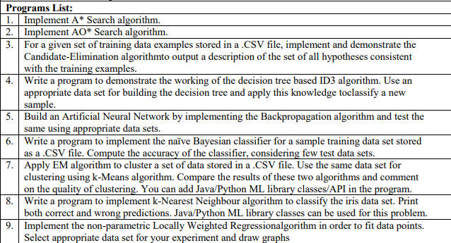

# Links
- [Questions](#aiml-vtu-sem7-updated)
- [Viva questions](#viva)
- [Output](#outputs)

# Aiml-vtu-sem7-updated

# VIVA
## 1.What is the difference between clustering and classification?

## 2.What is Machine Learning?
## A model to gain knowledge and predict for upcoming data.

## 3.What is Supervised, Unsupervised and reinforcement learning?
Supervised-labelled does classification
unsupervised-not labeled finds similarity
reinforcement-continous learning by reward and penalty

## 4.Why EM is better than KMeans?
## the K-means algorithm differs in the method used for calculating the Euclidean distance while calculating the distance between each of two data items; and EM uses statistical methods.

## 5.What is Perceptron?
### A Perceptron is a neural network unit that does certain computations to detect features or business intelligence in the input data. 

## 6.General Steps in Machine Learning?

## 7.Collection of Data, Data preprocessing?
Collection of data-identifying sources,data quality,new features
Data preprocessing- data cleaning,filtering,removing outliers

## 8.Data validation vs testing ?
Validation set is used for determining the parameters of the model, 
and test set is used for evaluate the performance of the model

## 9.What is centroid in kmeans and how do u determine ?
Centroid- imaginary center of cluster
By averaging the data points feature wise

## 10.Naive Bayes formula

## 11.Forward propagation and backpropagation?
Forward Propagation is the way to move from the Input layer (left) to the Output layer (right) in the neural network. The process of moving from the right to left i.e backward from the Output to the Input layer is called the Backward Propagation.

## 12.If for P(C1/X) and P(C2/X) is found using naive bayes classifier which gives higher accuracy or which one would the model choose
Greater the probability it gives higher accuracy

## 13.

## 14.

# Outputs

## 1

## 2

## 3

## 4

## 5

## 6

## 7

## 8

## 9

